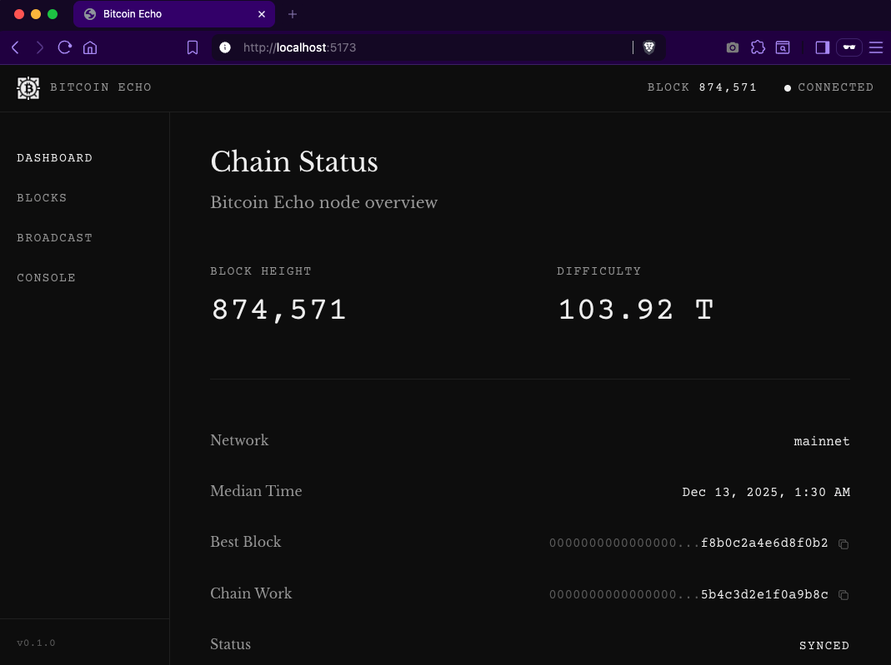

# Bitcoin Echo GUI

**A window into the last Bitcoin implementation.**



Most software wants to grow forever. Bitcoin Echo wants to finish.

This GUI is how you see it — a browser-based interface to a running [Bitcoin Echo](https://github.com/bitcoinecho/bitcoin-echo) node. It communicates exclusively via JSON-RPC. No wallet. No bloat. Just Bitcoin, visible.

---

## Philosophy

The Bitcoin Echo node is *ossified* — frozen code that implements the Bitcoin protocol once, correctly, and stops. The GUI is different: it can evolve. Think of it as a window into an artifact, not part of the artifact itself.

**The node:** Pure C. Zero dependencies. Consensus frozen forever.

**The GUI:** SvelteKit. Can improve. A view, not a vault.

---

## Stack

| Layer | Technology |
|-------|------------|
| Framework | [SvelteKit](https://kit.svelte.dev/) (SPA mode) |
| Language | TypeScript |
| Styling | [Tailwind CSS](https://tailwindcss.com/) |
| State | Svelte stores |
| Build | Vite |

Why Svelte? It compiles away. ~2KB runtime vs 40KB for React. The framework disappears — much like how Bitcoin Echo disappears into permanence once complete.

---

## Running

**Prerequisites:** Node.js 20+ (use `nvm use` if you have nvm)

```bash
# Clone
git clone https://github.com/bitcoinecho/bitcoinecho-gui.git
cd bitcoinecho-gui

# Install
npm install

# Run development server
npm run dev
```

Open [http://localhost:5173](http://localhost:5173)

**Note:** The GUI expects a Bitcoin Echo node running on `localhost:8332`. Without a node, you'll see mock data.

---

## Building

```bash
npm run build
```

Output goes to `build/`. Serve it with any static file server.

---

## Project Structure

```
src/
├── lib/
│   ├── components/   # Button, Card, Badge, Hash, etc.
│   ├── rpc/          # JSON-RPC client (Phase 1)
│   └── stores/       # Svelte stores (Phase 1)
├── routes/           # SvelteKit file-based routing
│   ├── +layout.svelte
│   ├── +page.svelte  # Dashboard
│   ├── blocks/       # Block explorer (Phase 4)
│   ├── tx/           # Transaction view (Phase 5)
│   ├── broadcast/    # TX broadcast (Phase 5)
│   └── console/      # RPC console (Phase 6)
└── app.html
```

---

## Roadmap

See [GUI_ROADMAP.md](https://github.com/bitcoinecho/bitcoinecho-org/blob/main/GUI_ROADMAP.md) for the full implementation plan.

| Phase | Status |
|-------|--------|
| 0. Foundation | ✅ Complete |
| 1. RPC Client | 🔲 Not started |
| 2. Mock Mode | 🔲 Not started |
| 3. Dashboard | 🔲 Not started |
| 4. Block Explorer | 🔲 Not started |
| 5. Transaction View | 🔲 Not started |
| 6. RPC Console | 🔲 Not started |
| 7. Polish | 🔲 Not started |

---

## Related

- [bitcoin-echo](https://github.com/bitcoinecho/bitcoin-echo) — The ossified node (Pure C)
- [bitcoinecho-org](https://github.com/bitcoinecho/bitcoinecho-org) — Website, whitepaper, roadmap
- [bitcoinecho.org](https://bitcoinecho.org) — Project home

---

## License

MIT — Do whatever you want. This is Bitcoin.

---

*Build once. Build right. Stop.*

**Bitcoin Echo: The Last Implementation. Now Visible.**
